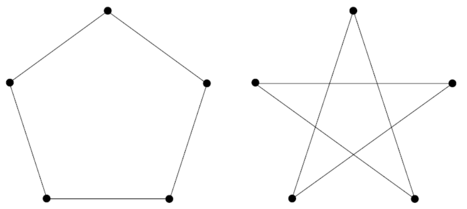
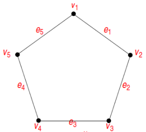
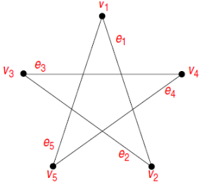
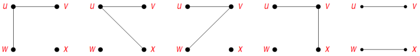
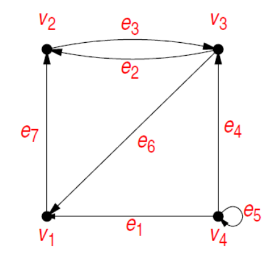
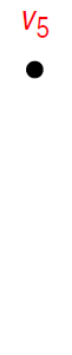
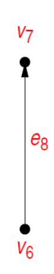
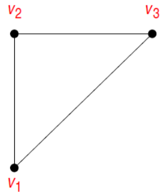
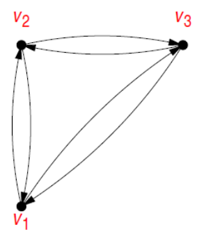

# Grafos

## Introdução

Suponha que precisamos implementar um algorítmo que será responsável por armazenar um grupo de dados que precisam ser interligados entre si, como fariamos isso?

A **teoria dos grafos** é um ramo da matemática que estuda as relações entre os objetos de um determinado conjunto. para isso foram criados os grafos, estruturas **G(V,E)**, onde **V** é um conjunto não vazio de objetos denominados vértices (nós) e **E** (Arestas) é um subconjunto de pares não ordenados de **V**.

## Uso de grafos

Existem diversas áres que utilizam de grafos, segue alguns exemplos:

| **Grafos**  | **Vértice**          | **Aresta** |
| ----------- | -------------------- | ---------- |
| comunicação | Centreis telefônicas | Cabos      |
| circuitos   | Portas lógicas       | Filamentos |
| Hidráulicos | Reservatórios        | Tubulações |
| financeiro  | Ações                | Transações |
| transporte  | Cidades              | Rodovias   |

## Terminologia

- Cada aresta está associada a um conjunto de <u>um ou dois vértices</u>, chamados nós terminais;
- **Extremidade** de uma aresta: vértice da aresta;
- Função aresta-extremidade: associa aresta a vértices;
- **Laço** (Loop): aresta somente com nó terminal;
- Arestas **paralelas**: arestas associadas ao mesmo conjunto de vértices;
- Uma aresta **Conecta** seus nós terminais;
- Dois vértices que são conectados por uma aresta são chamados de **adjacentes**;
- Um vértice que é nó terminal de um laço é dito ser **adjacente a si próprio**;
- Uma aresta é dita ser **incidente** a cada um de seus nós terminais;
- Duas arestas incidentes ao mesmo vértice são chamadas de **adjacentes**;
- Um vértice que não possui nenhuma aresta incidente é chamado de **isolado**;
- Um grafo com nenhum vértice é chamado de **vazio**;

## Exercício 1

- Considere os dois diagramas abaixo. Rotule os vértices e as arestas de tal forma que os dois diagramas respresentem o mesmo grafo;

    

- **Resposta**

Uma possível identificação de vértices e rótulos pode ser:

    
    

  

<ul style="max-width: 10rem">
    <li> Os dois diagramas são representados por: {v1,v2,v3,v4,v5}. </li>
    <li> Conjunto de arestas: {e1,e2,e3,e4,e5}. </li>
</ul>

 Função aresta-vértice:

| **Aresta** | **Vértice** |
| ---------- | ----------- |
| e1         | {v1,v2}     |
| e2         | {v2,v3}     |
| e3         | {v3,v4}     |
| e4         | {v4,v5}     |
| e5         | {v5,v1}     |

  

## Grafo Simples

- <u>Definição:</u>
  Um grafo simples é um grafo que não possui laços nem arestas paralelas.

* aresra com vértices (nós terminais) **_u_** e **_v_** é representadas por **_uv_**.

 
 Exemplo: 
Quais são os grafos com quatro vértices {**_u,v,w,x_**} e duas arestas, sendo que uma delas é a aresta **_uv_**?

- Dado quatro vértices, existem C(4,2) = 6 subconjuntos, que definem arestas diferentes: {**_uv,uw,ux,vw,vx,wx_**}.
- Logo, todos os grafos simples de quatro vértices e duas arestas, sendo uma delas a **_uv_** são:

    

## Grafo dirigido

- <u>Definição: </u>

* Um grafo dirigido ou digrafo ou direcionado _**G**_ consiste de dois conjuntos finitos:

    Vértices _**V(G)**_
    Arestas dirigidas E(G), onde cada aresta é associada a um par ordenado de vértices chamados de nós terminais. se a aresta _**e**_ é associada ao par (_**u,v**_) de vértices, diz-se que _**e**_ é a aresta dirigida de _**u**_ para _**v**_.

    
    
    

* A versão dirigida de um grafo não dirigido _**G = (V,E)**_ é um grafo dirigido _**G¹=(V¹,E¹)**_ onde (_**u,e**_) E E¹ (_**u,v**_) E E.
* Cada aresta não dirigida (_**u,v**_) em _**G**_ é substituida por duas areas dirigidas (_**u,v**_) e (_**v,u**_).
* Em um grafo dirigido, um vizinho de um vértice _**u**_ é qualquer vértice adjacente a _**u**_ na versão não dirigida de _**G**_.

    <h3>Grafo não dirigido:</h3>
    

    <h3>Grafo dirigido correspondente:</h3>
    

## Grafo completo

- <ul>Definição:</ul>

    Um grafo completo de _n_ vértices, denominado _Kn_, é um grafo simples com _n_ vértices _v1,v2,...,vn_, cujo conjunto de arestas contém exatamente uma aresta para cada par de vértices distintos.

- <ul>Nota:</ul>

    A letra _K_ representa a letra inicial da palavra komplett do alemão, que significa "completo".

-<ul>Exemplo:</ul>

    Grafos completos com 2, 3, 4 e 5 vértices.

