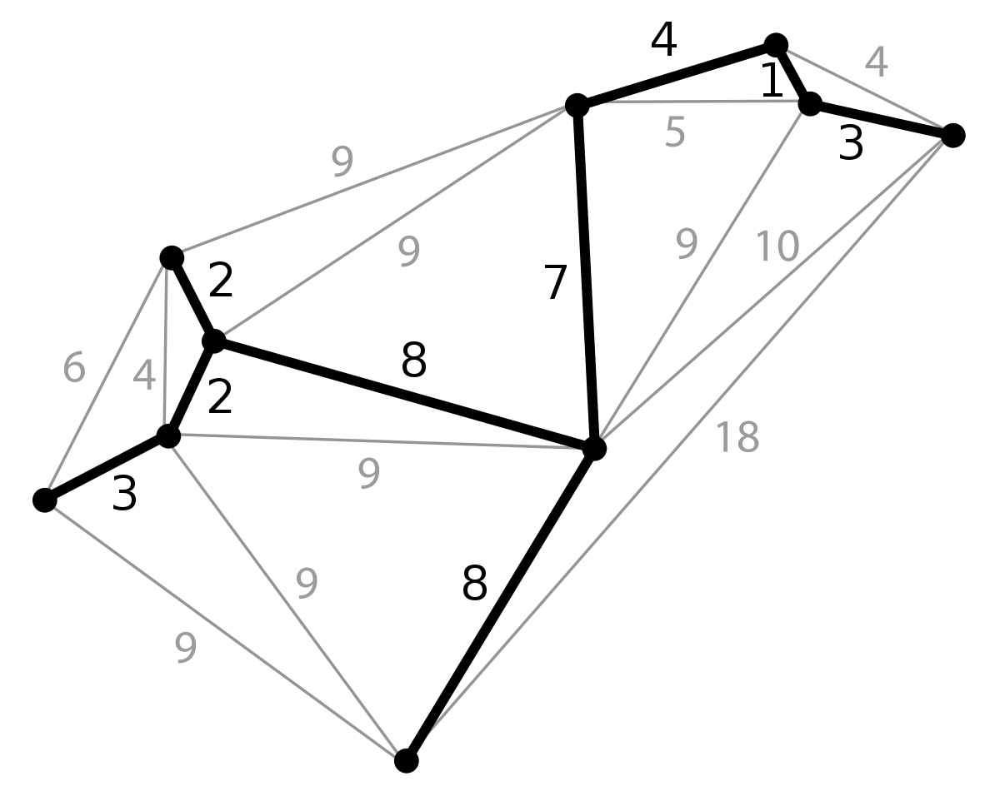
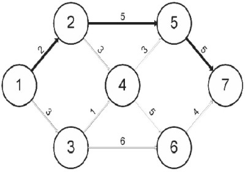
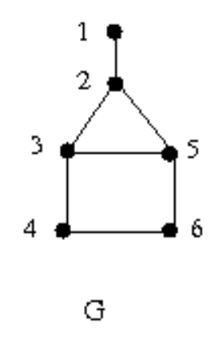

# Conteudo

- Divisão e conquista
- Ordenação
- Grafos
- Algoritmo de Dijkstra (Complexodade de problemas. Análise amortizada).

## Lista de exercícios

1. Defina árvore geradora mínima e caminho mínimo em grafos:

   **Árvore geradora**
   É um subconjunto de grafos um grafo não dirigido que contem todos os vertices.

   **Árvore geradora mínima**
   Tendo um grafo não dirigido conectado, com suas arestas contendo pesos , uma árvore geradora mínima é o conjunto que contem as arestas com menor peso.

   **Caminho mínimo em grafos**
   É uma minimização do custo de travessia de um grafo entre dois nós;
   Esse custo é dado pela soma dos pesos de cada aresta percorrida;

    

    
    
    

2. Defina a matriz de adjacência do grafo G abaixo:
   
   

   
   

~~~
     1 2 3 4 5 6
    ---       ---
1   |0,1,0,0,0,0|
2   |1,0,1,0,1,0|   
3   |0,1,0,1,1,0|   
4   |0,0,1,0,0,1|   
5   |0,1,1,0,0,1|   
6   |0,0,0,1,1,0|
    ---       ---
~~~

3. Em uma busca em largura, o valor **d[u]** atribuído a um vértice **u** é independente da ordem na qual são dados os vértices em cada lista de adjacência. Verdadeiro ou Falso ? Justifique sua resposta.

   **Verdadeiro**
    
    se trata na inicialização dos arrays de adjacência.
 

4. Execute uma busca em profundidade a partir do vértice 0 no grafo orientado dado pelas listas de adjacência a seguir. Exiba o rastreamento da busca.
    
    | `00` | 01 | 04 | 
    | `01` | 02 | 05 | 
    | `02` | 03 | 
    | `03` | 07 | 
    | `04` | 08 | 
    | `05` | 04 | 
    | `06` | 05 | 10 | 02 | 
    | `07` | 11 | 06 | 
    | `08` | 09 | 
    | `09` | 05 | 08 | 
    | `10` | 09 | 
    | `11` | 10 | 

5. Dado o seguinte grafo:
   

   
   

   Supondo que as listas de adjacências armazenam os vértices em ordem crescente pede-se:
   A) A ordem ded acesso aos nós numa busca em largura.
   B) O vetor pi[v] e a árvore de busca em largura.
   C) A ordem de acesso aos nós numa busca em profundidade.
   D) Os vetores d e f e a árvore de busca em profundidade.

6. Se existe um caminho de u para v em um grafo orientado F, então qualquer busca em profundidade deve resultar em d[v]<=f[u]. Verdadeiro ou Falso? justifique sua resposta.

7. Dado um grafo orientado representado or uma lista de adjacências, qual a complexidade do processo de calcular o maior grau de saída de um vértice ? Justifique sua resposta descrevendo o processo.

8. Considerando o seguinte grafo:
   

   
   

   Responda as questões a seguir iniciando os algoritmos elo vértice "A" e dispondo os vértices sucessores em ordem alfabética.
   A) Utilize o algoritmo de Prim para encontrar uma árvore geradora mínima para o grado. justifique sua resposta apresentando os valores de pi e ke gerados pelo algoritmo.
   B) Utilize o algoritmo de Kruskal com conjuntos disjuntos com florestas para encontrar uma árvore geradora mínima para o grafo. Justifique sua resposta apresentando a árvore final presente conjunto disjunto.

9. Dado o grafo ponderado abaixo, aplique o algoritmo de Dijkstra para encontrar o caminho mínimo a partir do nó a até o nó e. Mostre ainda os valores finais dos vetores dist[ ] e prev[ ] considerando a ordem dos nomes vértices como sua posição.
   

   
   

10. Se existe um caminho do vértice u para o vértice v num grafo dirigido G, então qualquer pesquisa em profundidade deve resultar em d[v]<=f[u]?

11. Se existe um caminho do vértice u para o vértice v num grafo dirigido F e se d[u] < d[v] na pesquisa em profundidade de G, então o vértice v é um descendente do vértice u na floresta de pesquisa em profundidade obtida?

12. O que é um max-heap ?

13. Diferencie problemas P, NP e NP-completos.

14. Dada a sequência de números: 7 2 9 4 3 8 6 1, Ordene em ordem crescente utilizando o algoritmo MergeSort, apresentando a sequência dos números a cada passo.

15. O que é um algoritmo de ordenação estável ?

16. O que diferencia os algoritmos de margeSort e Quicksort ?

17. Quais métodos de ordenação são baseados em divisão e conquista ?
